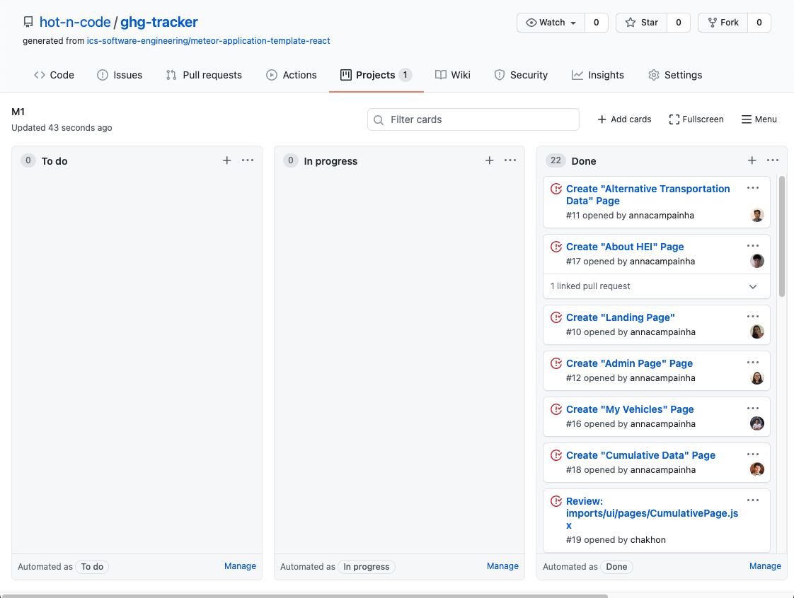

# Table of Contents
* [Meet the Team](#meet-the-team)
* [Project Goals](#project-goals)
* [Development History](#development-history)

## Meet the Team:
Sophia C.  
Yiwen  
Timothy  
Chak  
Anna  
Jackie  
Vince Khyla  
Michael  
Daphne  

## Project Goals
To produce a successful application that allows users to track and visualize their greenhouse gas emissions from transportation and persuade the community to reduce 
their carbon footprints by opting for eco-friendly alternatives. 

## Development History
### Milestone 1: Mockup Development
The goal for this milestone is to create mockup designs for the pages we want to implement for the web application. We also tried to recreate our designs in code to create a functional mockup.

